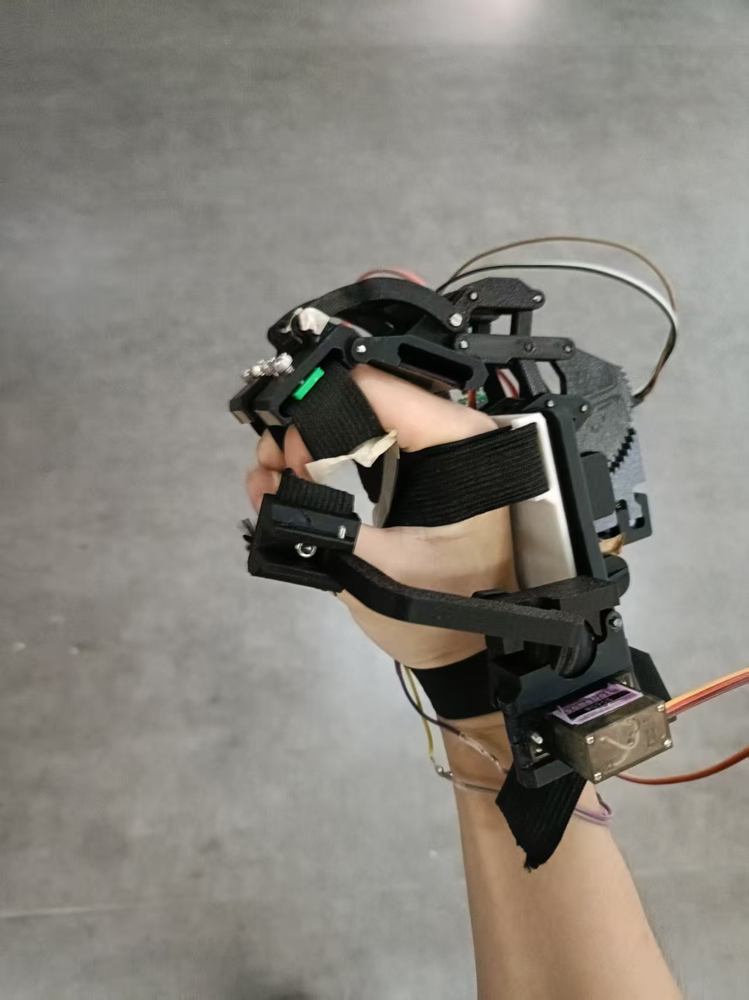
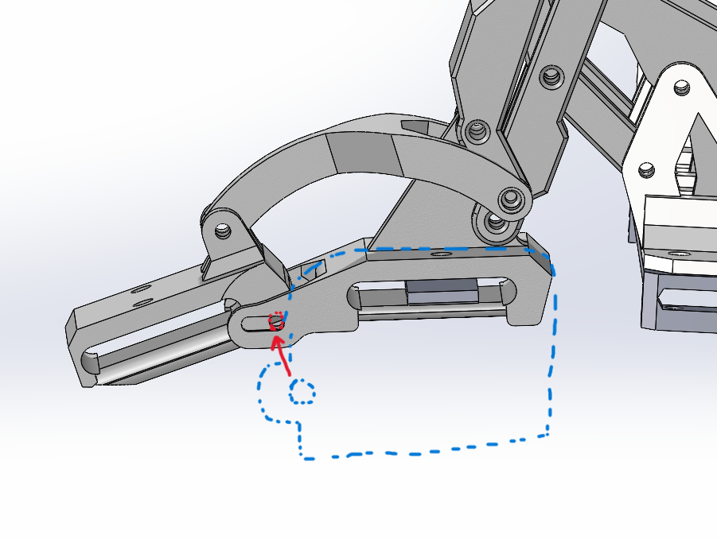
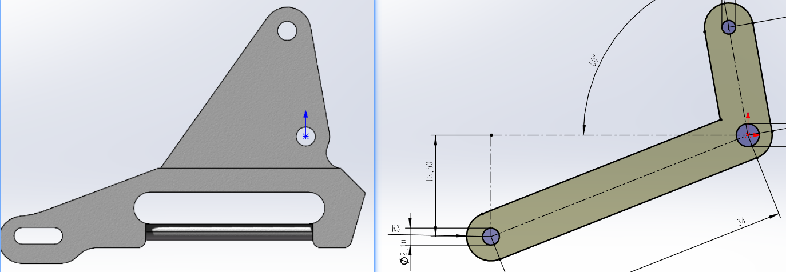
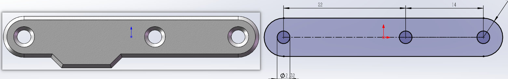

# 说明文档（想到什么写什么）

## 目录  
1. 项目简介
2. 机械部分介绍
3. 嵌入式软件部分介绍
4. 嵌入式硬件部分介绍
5. 复现须知

## 1 项目简介
本项目是一对可以锁止的外骨骼手套（下称手套），用于在攀爬的过程中锁止，以节省攀爬者的体力，保证安全（至少课题是这么说的）。手套完全由手指驱动，只在感受到压力的情况下，由舵机驱动锁止，因此系统功耗极低。据实测，舵机的功耗只有在锁止或者释放的时候会略超过3.7V*0.01A，其余时间均远小于该值。经过不严不松的注水分析，完全复现该项目所需要的物料成本可以控制在400以内，以满足+3分的课设要求。    
  
手套主要有机械连杆部分（跟随手指移动）、机械锁止部分（用于锁住连杆）和嵌软控制部分组成。连杆的设计基本上完全参考另一开源项目https://github.com/ksDreamer/hand_exoskeleton ，并对其做了轻微的改变以适应新的需求。  

## 2 机械部分介绍

### 2.1 连杆
一个手套中的连杆包括食指和中指的1自由度连杆，以及拇指的2自由度连杆。因为课设要求每个手套只用做2根手指以上，所以就只为食指和中指这两根除拇指外力量最大的手指做了连杆。    

#### 2.1.1 食指、中指连杆
为了方便（那么代价是什么呢），本项目的食指连杆和中指连杆的参数完全一致，均来源于上述开源项目中的食指的参数。  

为了增强连杆结构的稳定性，把指节处的连接孔位相对上移，这样就不会和穿戴空间产生冲突，使得两边的连杆可以通过手指上方的一根长钢轴连接起来，而非分布于手指两侧的很短的钢轴或螺丝。这种设计也取消了连杆对于手指的全包围结构，使得手指在运动过程中不会受到两侧和下方的阻碍，感受更灵敏，适配的手指粗细范围更广。  
   
上图展示了结构的变化。蓝色虚线部分表示原项目中连杆的实体投影，红色箭头表示连接孔位的移动方向  

除此之外，其余连杆均改进成了双端结构，极大提高了结构强度。

手指与连杆的穿戴采用弹力带。剪下一小段弹力带，将其穿过连杆中间的带槽，在确保头尾两端都在带槽中后，在带槽上方预留的两颗m3孔中拧入两颗m3*6/8的螺丝将弹力带压紧。  

#### 2.1.2 拇指连杆
未完待续

### 2.2 锁止机构
手指连杆的锁止使用棘轮方案实现。连杆的根部（也就是拳头那一块）呈大约1/4的棘轮形状，和另一轮廓与之啮合的活动锁止块相配合。活动锁止块由舵机带着前后移动，但并非与舵机直接连接，而是借由一个主动锁止块和弹簧弹性连接。活动锁止块与主动锁止块之间有机械限位，主动块对活动块的推力通过弹簧传递，拉力通过机械限位的结构传递，这样就能做到舵机在锁止时，带着主动块推动活动块向棘轮移动直到啮合；在释放时，带着主动块拉动活动块直到解除啮合。  

舵机与主动锁止块之间通过连杆连接。本项目中，为节省空间和降低功耗，食指和中指的外骨骼连杆的锁止和释放由一个舵机同时控制。由于主要结构都是PLA打印件，刚度较低容易形变，舵机在运动时难免因为受力而偏离原来的轴线，导致两根手指的活动锁止块运动不一致，经常是一根手指的外骨骼的棘轮啮合的非常紧，而另一根的棘轮还是松的。为解决这个问题，为舵机设计了一个双端连杆，以增大刚度，保证舵机的输出轴线一致。

### 3 嵌入式软件
欸嘿

### 4 嵌入式硬件
欸嘿

### 5 复现须知
#### 5.1 问题
由于更改了连杆的一部分参数而没有对其他参数做相对应的调整，连杆并不能完全跟随手指移动，这种情况对于中指更为严重，因为中指的参数和食指一致，但实际上中指比食指长，甚至会让手指关节顶到外骨骼，握紧的时候还挺痛的。   
 解决办法：
1 按比例适当增加中指外骨骼连杆的长度。具体的比例可能需要调整几次，最简单的办法是回到原项目https://github.com/ksDreamer/hand_exoskeleton 中把中指的连杆的数据全部测一遍（。然后再调整本项目每个连杆的零件的尺寸。本项目中每个连杆零件最基本的定义均是由连接孔位的相对位置确定（即最简化的连杆），所以参数还算好改，一般来说也不会报错  
     
   
2 微调连杆其他部分的参数，使得外骨骼整体上能始终与手指实际的运动保持一致，这就比较繁琐了，但是比较治本的方法  

#### 5.2 紧固件
装配使用的只有m3螺丝、m1.6塞打和m2钢轴，装配体中没有加入这些零件，但可以通过孔的特征判断对应的零件。孔径在3.2-3.4的对应m3螺丝；孔径在2.2-2.4或者还要大一点的，对应m2钢轴，只不过配合的松紧程度不一样；孔径小于2的，为塞打螺丝攻丝的部分，一个通孔由大孔和小孔组成，大孔厚度为1、孔径大于3.6，小孔孔径在2.7-2.9之间的，对应塞打螺丝的头部和肩部  

#### 5.3 物料清单
BOM.xlsx中的物料清单供参考

